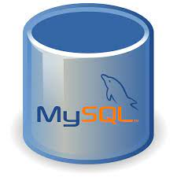

<h1>Email a random XKCD challenge</h1>


---

## Index :pushpin:

- [About](#about)
- [API EndPoint](#apiendpoint)
- [Architecture Diagram](#architecture)
- [AWS-SES](#awsses)
- [Software and Technology Used](#Technology)
- [XKCD Properties](#xkcdproperties)
- [cURL (client URL)](#cUrl)
- [Website Security Vulnerabilities](#Security)
- [CRON Expressions](#CRON)
- [Deployment](#Deploy)

## About <a name="about"></a> :bulb:

- xkcd is a webcomic created in 2005 by American author Randall Munroe. The comic describes it as "a webcomic of romance, sarcasm, math, and language".
- They are cool programming comics and have an API for them!
- In this challenge it's important to keep in mind the limitations of the data the API serves. When working with getting a random comics we need to consider the "limits" of those numbers.

## API EndPoint <a name="apiendpoint"></a> :link:

- http://xkcd.com/info.0.json (current comic)

- http://xkcd.com/614/info.0.json (comic #614)

The API is not a typical paginated REST service. You can get the latest comic via the https://xkcd.com/info.0.json URL. The response will contain the ID of the latest comic. To get previous comics, you need to call https://xkcd.com/{comic_id}/info.0.json, where {comic_id} is the ID of the comic, lower then the latest comic (for example information about comic #614 will be in https://xkcd.com/614/info.0.json).

## Architecture Diagram <a name="architecture"></a> :pencil2:

- This diagram shows how the system and its layers were separated to understand each part of the tests.
  

---
## AWS-SES <a name="awsses"></a> :pencil2:
### Basic Usage

```php
<?php


$m = new SimpleEmailServiceMessage();
$m->addTo('Recipient Name <recipient@example.com>');
$m->setFrom('Sender <user@example.com>');
$m->setSubject('Hello, world!');
$m->setMessageFromString('This is the message body.');

$ses = new SimpleEmailService('AccessKey', 'SecretKey');
$ses->sendEmail($m);


```

### Recipients

```php
<?php

$m = new SimpleEmailServiceMessage();
// Add many Recipients
$m->addTo(array('dwight@example.com', 'angela@example.com'));

// You can either add one by one or pass an array to 'To' and 'CC'
$m->addCC('holly@example.com');
$m->addCC(array('kelly@example.com', 'ryan@example.com'));

// And 'BCC' and 'Reply-To' as well
$m->addBCC('michael@example.com');
$m->addBCC(array('kevin@example.com', 'oscar@example.com'));
$m->addReplyTo('andy@example.com');
$m->addReplyTo(array('stanley@example.com', 'erin@example.com'));


// Also add names to any of the Recipients lists
$m->addTo('Jim Carrey <jim@example.com>');
```

### Message body

```php
<?php
// And have both Text and HTML version with:
$m->setMessageFromString($text, $html);
$m->setMessageFromFile($textfilepath, $htmlfilepath);

// You can also set the encoding of the Subject and the Message Body
$m->setSubjectCharset('ISO-8859-1');
$m->setMessageCharset('ISO-8859-1');
```

The default is UTF-8 if you do not specify a charset, which is usually the right setting. You can read more information in the [SES API documentation](http://docs.amazonwebservices.com/ses/latest/APIReference/API_Content.html)

### Attachments

```php
<?php
//attach the image from url
$m-> addAttachmentFromUrl($name, $url, $mimeType = 'application/octet-stream', $contentId = null, $attachmentType = 'attachment')
```
- This class diagram showing the aws-ses classes, their attributes and methods.
  

  

---

## Technology and software used<a name="Technology"></a> :small_blue_diamond:

<br>
<table>
<tbody>
 <tr>
<td align="center" width="20%">
<span><b><center>PHP</center></b></span> 
 
</td>

<td align="center" width="20%">
<span><b><center>CSS</center></b></span> 
 
</td>

<td align="center" width="20%">
<span><b><center>HTML</center></b></span> 
 
</td>
</tr>

<tr>
<td align="center" width="20%">
<span><b><center>JavaScript</center></b></span> 
 
</td>

<td align="center" width="20%">
<span><b><center>Github</center></b></span> 
 
</td>

<td align="center" width="20%">
<span><b><center>MYSQL</center></b></span> 
 
</td>
</tr>

<tr>
<td align="center" width="20%">
<span><b><center>AWS</center></b></span> 
 
</td>

<td align="center" width="20%">
<span><b><center>LAMP Stack</center></b></span> 
 
</td>

<td align="center" width="20%">
<span><b><center>Filezila</center></b></span> 
 
</td>
</tr>

<tr>
<td align="center" width="20%">
<span><b><center>VScode</center></b></span> 
 
</td>

<td align="center" width="20%">
<span><b><center>JavaScript</center></b></span> 
 
</td>

<td align="center" width="20%">
<span><b><center>Lucidchart</center></b></span> 
 
</td>
</tr>

</tbody>
</table>

---

## XKCD Properties <a name="xkcdproperties"></a> :ballot_box_with_check:

The `xkcdcomic` has properties with information of the comics. These are:

### Properties defined internally in the XKCD API

- `year`: The year the comic was released in
- `month`: The month the comic was released in
- `day`: The day in month the comic was released on
- `num`: The ID of the comic
- `title`: The title of the comic
- `safe_title`: The safe title of the comic
- `transcript`: The transcript of the comic (if avaliable)
- `alt`: The hover text
- `img`: The URL to the comic image

---

## cURL (client URL) <a name="cUrl"></a> :fire:

```PHP
$curl = curl_init();                              
   // Create cURl resources with initialize function
   //$curl is going to be datatype curl resource
curl_setopt($curl, CURLOPT_URL, $url);              // Set cURL options
   //Once cURL resource is created, When can then manipulate   that resource using functions, specifically  designed for that resource (eg:Curl_setopt())

curl_setopt($curl, CURLOPT_RETURNTRANSFER, true);  
 //able to store the result in variable instead for showing directly to the browser
curl_error($curl);                                
   //Return a string containing the last error for the current session
curl_exec($curl);                                 
   //Run cURL (execute http request )
curl_close($curl) ;                                 
 // Close cURL resource
```

## Website Security Vulnerabilities and Prevention<a name="Security"></a> :boom:

### SQL injection

SQL injection is a code injection technique used to attack data-driven applications, in which malicious SQL statements are inserted into an entry field for execution (e.g. to dump the database contents to the attacker)


### Cross-site scripting (XSS)

Cross-site scripting (XSS) is a type of security vulnerability typically found in web applications. XSS attacks enable attackers to inject client-side scripts into web pages viewed by other users.


## CRON Expressions <a name="CRON"></a> :stopwatch:

A CRON expression is a string representing the schedule for a particular command to execute. The parts of a CRON schedule are as follows:

    *    *    *    *    *
    -    -    -    -    -
    |    |    |    |    |
    |    |    |    |    |
    |    |    |    |    +----- day of week (0 - 7) (Sunday=0 or 7)
    |    |    |    +---------- month (1 - 12)
    |    |    +--------------- day of month (1 - 31)
    |    +-------------------- hour (0 - 23)
    +------------------------- min (0 - 59)

A Cron expression will run in every 5th minute

    */5  *    *     *    *

## Deployment <a name="Deploy"></a> :globe_with_meridians:

<h3>Amazon Elastic Compute Cloud (Amazon EC2)</h3>
Amazon Elastic Compute Cloud (Amazon EC2) is a web service that provides secure, resizable compute capacity in the cloud. It is designed to make web-scale cloud computing easier for developers.

<h3>LAMP</h3>
LAMP (Linux, Apache, MySQL, PHP) is an acronym denoting one of the most common solution stacks for many of the web's most popular applications. However, LAMP now refers to a generic software stack model and its components are largely interchangeable.

## Output <a name="output"></a>:heavy_check_mark:
<a href="readmeimg/scimg/otp-screenshot.jpg" target="_blank"></a><a href="readmeimg/scimg/comic-screenshot.jpg" target="_blank"></a>


